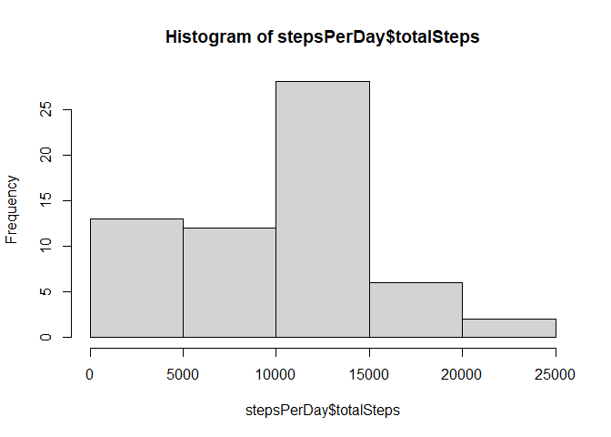
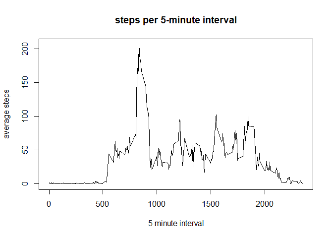
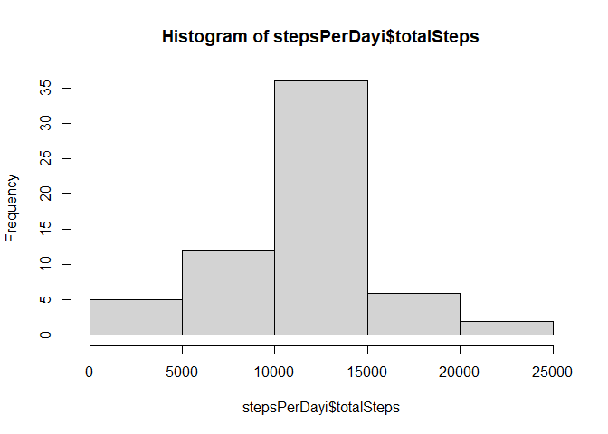

## Loading and preprocessing the data

```r
library(utils)
# 1. Code for reading in the dataset and/or processing the data
suppressWarnings(unzip(zipfile = ".\\activity.zip", overwrite=FALSE))
df <- read.csv(".\\activity.csv", na.strings = NA)

# transform date field and add field for weekDay
df$date <- strptime(df$date,"%Y-%m-%d")
df$weekDay <- weekdays(df$date)
df$group <- factor(ifelse(df$weekDay %in% c("Saturday", "Sunday"),
                          "weekend", "weekday"))
```

## What is mean total number of steps taken per day?

```r
stepsPerDay <- aggregate(df$steps, list(factor(df$date)), sum)
names(stepsPerDay) <- c("date", "totalSteps")
avgStepsPerDay <- aggregate(df$steps, list(factor(df$date)), mean)
stepsPerDay$avgSteps <- avgStepsPerDay$x
stepsPerDay[is.na(stepsPerDay$totalSteps),2] <- 0  # replace NA with 0
stepsPerDay[is.na(stepsPerDay$totalSteps),3] <- 0  # replace NA with 0
mean(stepsPerDay$totalSteps)
```

```
## [1] 9354.23
```

```r
# 2. Histogram of the total number of steps taken each day
par(mfrow=c(1,1))
hist(stepsPerDay$totalSteps)
```

<!-- -->

```r
# 3. Mean and median number of steps taken each day
summary(stepsPerDay$totalSteps)
```

```
##    Min. 1st Qu.  Median    Mean 3rd Qu.    Max. 
##       0    6778   10395    9354   12811   21194
```

## What is the average daily activity pattern?

```r
# 4. Time series plot of the average number of steps taken
intervalData <- data.frame(index= seq.int(unique(df$interval)), interval=unique(df$interval))
intervalData$meanSteps <- tapply(df$steps, df$interval, mean, na.rm=TRUE)
intervalData$medianSteps <- tapply(df$steps, df$interval, median, na.rm=TRUE)
names(intervalData) = c("index", "interval", "meanSteps", "medianSteps")
par(mfrow=c(1,1))
plot(intervalData$interval, intervalData$meanSteps, type="l",
     main="steps per 5-minute interval", xlab="5 minute interval",
     ylab="average steps")
```

<!-- -->

```r
# 5. The 5-minute interval that, on average, contains the maximum number of steps
intervalData[which.max(intervalData$meanSteps), 2]
```

```
## [1] 835
```

## Imputing missing values

```r
# 6. Code to describe and show a strategy for imputing missing data
# use mean value for each 5 minute interval to impute missing data
dfi <- df
dfi$steps[is.na(dfi$steps)] <- intervalData$meanSteps[match(dfi$interval, intervalData$interval)][which(is.na(dfi$steps))]

# compute steps per day of imputed data set
stepsPerDayi <- aggregate(dfi$steps, list(factor(dfi$date)), sum)
names(stepsPerDayi) <- c("date", "totalSteps")
avgStepsPerDay <- aggregate(dfi$steps, list(factor(dfi$date)), mean)
stepsPerDayi$avgSteps <- avgStepsPerDay$x
stepsPerDayi[is.na(stepsPerDayi$totalSteps),2] <- 0  # replace NA with 0
stepsPerDayi[is.na(stepsPerDayi$totalSteps),3] <- 0  # replace NA with 0
mean(stepsPerDayi$totalSteps)
```

```
## [1] 10766.19
```

```r
# 7. Histogram of the total number of steps taken each day after missing values are imputed
hist(stepsPerDayi$totalSteps)
```

<!-- -->

```r
summary(stepsPerDayi$totalSteps)
```

```
##    Min. 1st Qu.  Median    Mean 3rd Qu.    Max. 
##      41    9819   10766   10766   12811   21194
```

## Are there differences in activity patterns between weekdays and weekends?

```r
library(lattice)
xyplot(steps ~ interval|group, data=dfi, layout=c(1,2), type="l")
```

<!-- -->
